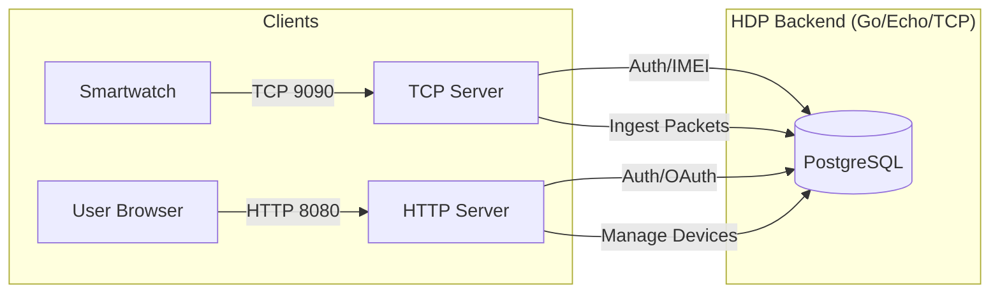

# System Architecture
## Health Data Platform

### High-Level Architecture
The Health Data Platform is a service-oriented Go backend with a dual-server architecture that provides a separation of concerns between high-throughput data ingestion (TCP) and user dashboard/API management (HTTP).

### Architecture Components
1. **API Gateway / Entrypoints (`/cmd/api`)**: The single Go binary starts both an Echo HTTP server (8080) and a TCP server (9090) in parallel.
2. **Business Logic Layer (`/internal/api/handlers`, `/internal/tcp`, `/internal/demo`)**: Core logic for Google OAuth authentication, session management, the `IW` protocol for smartwatch data, and demo TCP packet generation.
3. **Data Access Layer (`/internal/db`, `/internal/device`, `/internal/tcp/repository.go`)**: Abstracts interactions with PostgreSQL for device registration, user data, and the `device_packets` table.
4. **Shared Libraries (`/internal/auth`, `/internal/tcp/protocol`)**: Utilities for Google UserInfo, HMAC signing, and protocol parsing.

### Data Ingestion (TCP Ingestion)
1. **Connection Hook**: `net.Listen("tcp", addr)` accepts persistent connections.
2. **HandleConnection**: Each connection is handled in its own goroutine (state-loop).
3. **ScanFrame**: A custom `bufio.SplitFunc` that handles noise (newlines), delimiters (`[` or `]`), and '#' terminators for robust frame accumulation.
4. **Auth State Machine**: First packet must be `AP00` (Login) with valid IMEI. Connection is rejected if IMEI is not registered to a user.
5. **Persistence**: Valid data packets (GPS, Heart rate, etc.) are asynchronously or synchronously persisted to the `device_packets` table.

### User Flow (HTTP/API Dashboard)
1. **User Sign-In**: Authenticates via Google OAuth 2.0.
2. **Session**: An HMAC-signed cookie is issued, containing user ID and email.
3. **Dashboard**: The user accesses `dashboard.html` which fetches the device list and provides a registration form with real-time IMEI validation.
4. **Device Registration**: The user enters a 15-digit IMEI. The backend registers the device to the user's account in the `devices` table.
5. **Demo TCP Packet Generation** (optional): From the Packet Inspector page, users can start a demo session to generate synthetic health/location data for testing.

### Demo TCP Packet Generator
The platform includes a built-in demo feature (`/internal/demo`) for testing and demonstration:
- **SessionManager**: Manages persistent TCP connections to the localhost TCP server (9090).
- **PacketGenerator**: Generates random IW protocol frames (login, heart rate, GPS, sleep, etc.) with realistic data.
- **HTTP Endpoints** (protected):
  - `POST /protected/devices/:id/demo/session` — Start a demo session (backend connects to TCP server with device IMEI).
  - `DELETE /protected/devices/:id/demo/session` — Stop the demo session.
  - `GET /protected/devices/:id/demo/session` — Check if a demo session is active.
  - `POST /protected/devices/:id/demo/packets` — Send a burst of 7 random packets.
- **Use Cases**: Testing data ingestion pipelines, UI/UX prototyping, live demos without physical smartwatches.

### Diagram: High-Level Data Flow

